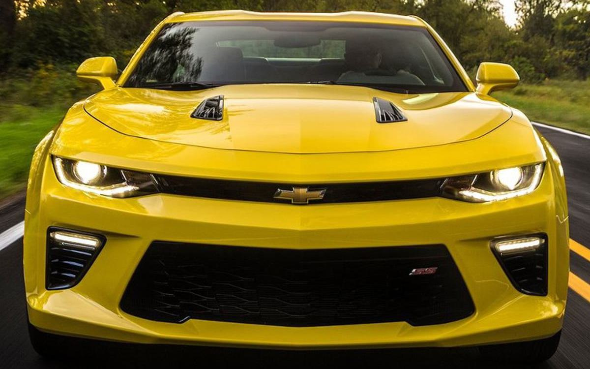
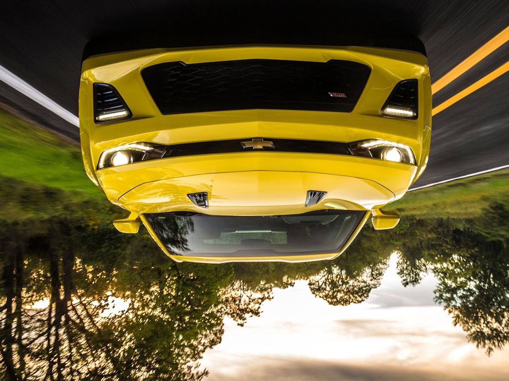
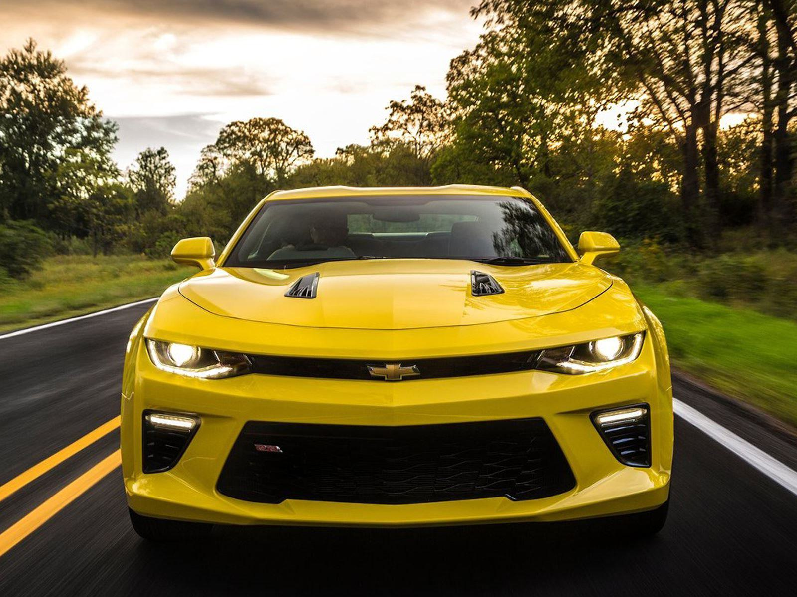
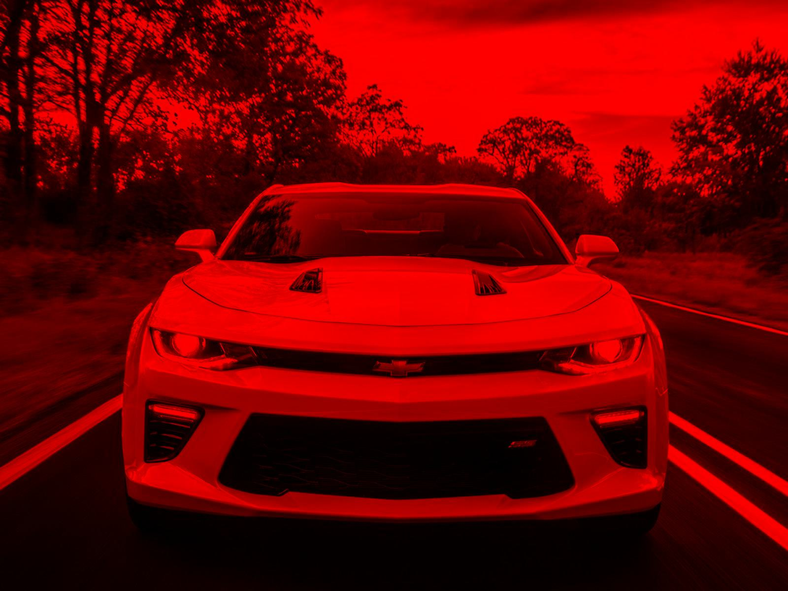
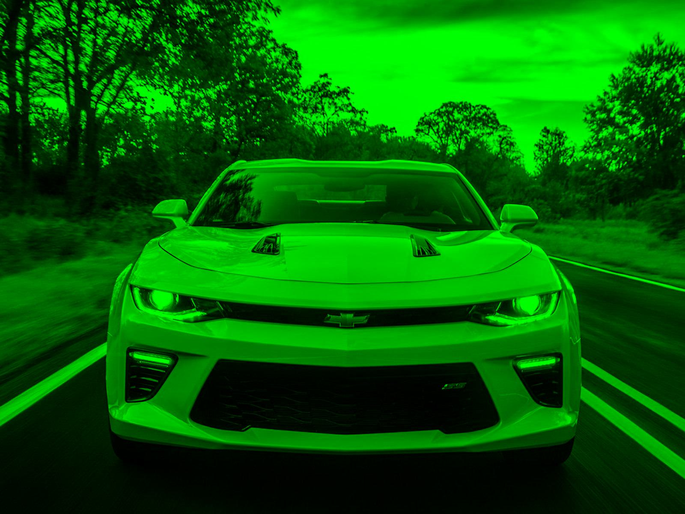
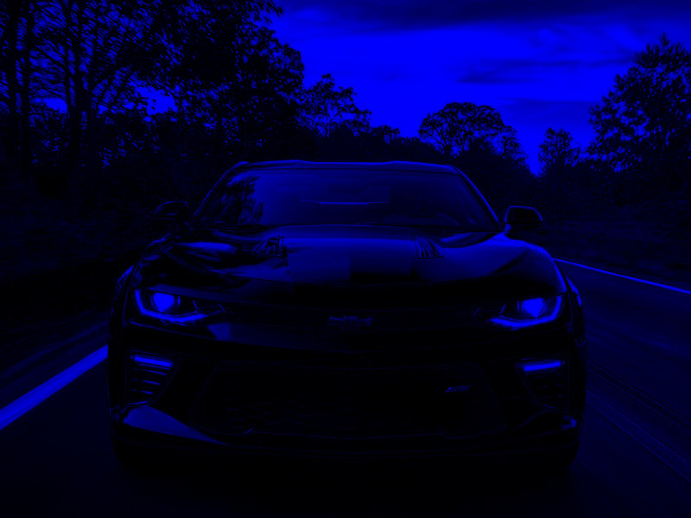
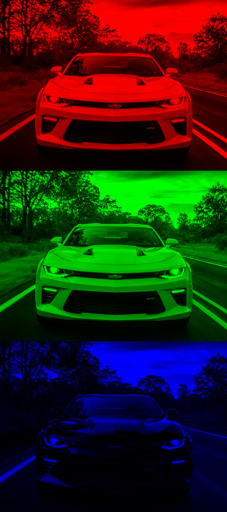

Let's import the necessary packages to dive in! 
import numpy, 
import scikit-image as io - allows to read an image 
import matplotlib - to visualize the image 

**io.imread** functionality will read an image into array of pixels 
In an color image we have intensity values for each of the three color channels red, green, blue.

**Shape** attribute display the how the image looks in a structure like how much width/tall/dimenional array(1d, 2d, 3d). 
Now let's create a camaro object to read our image and finds our shape of the image.

>camaro = io.imread("camaro.jpg")
>plt.imshow(camaro)
>plt.show()

##### Array operations

> Slicing an image - specify the axis 
> vertical stack - stack an array in a vertical order 
> flip the array - start, -stop, -step logic to exactly how we want to flip. For instance, -1 indicates to reverse the image 

##### Cropped Image

    cropped_array = img_array[start_row:end_row, start_col:end_col, :]
    # The ':', in the third dimension is for retaining all color channels (if present)

    cropped = camaro[0:500,:,:]
    plt.imshow(cropped)
    plt.show()
    
    cropped = camaro[:,400:1000,:]
    plt.imshow(cropped)
    plt.show()
    
    cropped = camaro[350:1100,200:1400,:]
    plt.imshow(cropped)
    plt.show()

##### To flip image vertically and horizontally

    vertical_flip = camaro[::-1,:,:]
    plt.imshow(vertical_flip)
    plt.show()
    io.imsave("vertical_flip.jpg", vertical_flip)

    
    horizontal_flip = camaro[:,::-1,:]
    plt.imshow(horizontal_flip)
    plt.show()
    io.imsave("horizontal_flip.jpg", horizontal_flip)

 

##### To colour our image

First we need to create an object called red with zeros.

    red = np.zeros(camaro.shape, dtype = "uint8")

We now want to fill in the rows and columns with the values for only the red channel and leave the other two color channel as zeros.

    red = np.zeros(camaro.shape, dtype = "uint8")
    
    red[:,:,0] = camaro[:,:,0]
    plt.imshow(red)
    plt.show()
    io.imsave("red.jpg", red)

 
 
    green = np.zeros(camaro.shape, dtype = "uint8")
    
    green[:,:,1] = camaro[:,:,1]
    plt.imshow(green)
    plt.show()
    io.imsave("green.jpg", green)

 
    
    blue = np.zeros(camaro.shape, dtype = "uint8")
    
    blue[:,:,2] = camaro[:,:,2]
    plt.imshow(blue)
    plt.show()
    io.imsave("blue.jpg", blue)

 

##### To stack all of our images

 

    vertical_stack = np.vstack((red,green,blue))
    plt.imshow(vertical_stack)
    plt.show()
    io.imsave("vertical_stack.jpg", vertical_stack)

How :cool: is that :sunglasses:!!!
